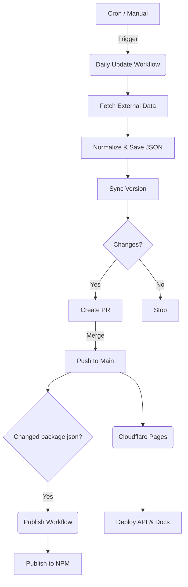

This guide documents the automated pipelines and workflows used to keep the Athena API up-to-date and deployed.

## 1. The Data Pipeline

The core of Athena is its "Static Data" architecture. Data is not fetched from a database at runtime; it is compiled into the application during the build process.

### Automated Updates (Daily)
We use a GitHub Action (`.github/workflows/daily-update.yml`) to keep data synchronized with the game.

1.  **Schedule**: Runs daily at 09:00 UTC.
2.  **Fetch & Scrape**:
    -   Fetches latest patches and stats from community sources.
    -   Scrapes Blizzard's official hero pages for official metadata.
3.  **Normalization**:
    -   Standardizes IDs (e.g., "Soldier: 76" -> "soldier-76").
    -   Merges data from multiple sources into `data/*.json` files.
4.  **Versioning**:
    -   Runs `scripts/sync-version.ts`.
    -   Checks the latest game patch from `data/patches.json`.
    -   **Rule**: If Game Version > Package Version, update to Game Version.
    -   **Rule**: If Game Version <= Package Version, increment Patch Version (e.g., `2.10.0` -> `2.10.1`).
5.  **Pull Request**:
    -   If changes are detected, a PR is automatically created with the title `chore(data): update hero data`.

### Manual Updates
To manually trigger an update (e.g., right after a big patch):
1.  Go to **Actions** tab in GitHub.
2.  Select **Daily Data Update**.
3.  Click **Run workflow**.

## 2. Publishing to NPM

The NPM package `athena-api` is published automatically when changes are merged to `main`.

**Workflow**: `.github/workflows/publish.yml`

1.  **Trigger**: Push to `main` where `package.json` has changed.
    -   *Note*: Merging the "Daily Data Update" PR triggers this because it bumps the version.
2.  **Build**:
    -   Runs `npm run build-data` to generate the TypeScript database.
    -   Runs `npm run build:lib` to compile the library.
3.  **Publish**:
    -   Authenticates with NPM using `NPM_TOKEN`.
    -   Publishes with public access.

## 3. Deployment (API & Docs)

The API and Documentation are hosted on **Cloudflare Pages**.

### Cloudflare Git Integration (Primary)
The production site is deployed automatically via Cloudflare's Git integration.

-   **Trigger**: Push to `main`.
-   **Build Command**: `npm run build`
-   **Output Directory**: `.output/public`
-   **Environment**: Cloudflare Pages (Nuxt Preset)

### Manual Deployment
For ad-hoc deployments or testing, the `deploy` script can be used locally (requires authentication):

```bash
npm run deploy
```

This runs the build and uploads the output using `wrangler pages deploy`.

## 4. Versioning Strategy

We aim to keep the API version in sync with the Overwatch 2 game version, but with our own patch cycles for fixes.

-   **Major.Minor**: Aligned with Overwatch 2 Patch versions (e.g., `2.9` is Season 9).
-   **Patch**: Incremented for *our* data fixes or hotfixes between game patches.

The `scripts/sync-version.ts` script handles this logic automatically:
-   It reads the latest patch from `data/patches.json`.
-   It ensures we never downgrade versions.

## Summary of Flow



